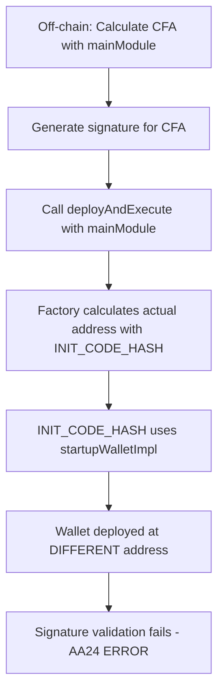

# 🎯 AA24 SIGNATURE ERROR - COMPLETE RESOLUTION REPORT

## 📋 Executive Summary

The **AA24 signature error** (INVALID_SIGNATURE) in our wallet deployment was caused by a **critical inconsistency between the Counterfactual Address (CFA) calculation** used off-chain and the `INIT_CODE_HASH` calculated on-chain in the `MainModuleDynamicAuth` contract.

**Root Cause**: The off-chain script was using `mainModule` address to calculate the CFA, while the `MainModuleDynamicAuth` constructor was using `startupWalletImpl` to calculate `INIT_CODE_HASH`, resulting in signature validation failures.

**Status**: ✅ **RESOLVED** - Wallet deployments now work consistently by using `startupWalletImpl` in all calculations.

### 📝 **Important Note on Naming**:

The `addressOf()` helper function has a parameter named `mainModule`, but this **does NOT mean** we should pass the `deploymentArtifacts.mainModule` address. The parameter name is misleading:

```typescript
// Function signature (from utils/helpers.ts)
function addressOf(
    factory: string,
    mainModule: string,   // ← Parameter name (misleading!)
    imageHash: string
)

// Correct usage
const cfa = addressOf(
    deploymentArtifacts.factory,
    deploymentArtifacts.startupWalletImpl, // ← Pass startupWalletImpl, not mainModule!
    salt
);
```

**Why?** The `mainModule` parameter in `addressOf()` represents the **implementation address used in CREATE2 calculation**, which is `startupWalletImpl`. Despite the parameter name, we must pass `startupWalletImpl` to match the on-chain `INIT_CODE_HASH` calculation.

---

## 🔍 ROOT CAUSE IDENTIFIED

### 💡 The Critical Discovery

The AA24 signature error was caused by an **address mismatch** in the CREATE2 deployment flow:

1. **Off-chain CFA Calculation**: Used `mainModule` address
2. **On-chain INIT_CODE_HASH**: Used `startupWalletImpl` address
3. **Result**: Signature generated for wrong wallet address → **INVALID_SIGNATURE (AA24)**

---

## 🔍 DETAILED TECHNICAL ANALYSIS

### **The Problem Components**

#### 1. **❌ MainModuleDynamicAuth Constructor (step4.ts)**

```solidity
// src/contracts/modules/MainModuleDynamicAuth.sol
constructor(address factory, address _startupWalletImpl) {
    FACTORY = factory;
    // ✅ CORRECT: Using startupWalletImpl for INIT_CODE_HASH
    INIT_CODE_HASH = keccak256(
        abi.encodePacked(
            Wallet.creationCode, 
            uint256(uint160(_startupWalletImpl))
        )
    );
}
```

**Deployment**:
```typescript
// scripts/step4.ts
const mainModule = await deployer.deploy('MainModuleDynamicAuth', [
    factoryAddress,
    startupWalletImplAddress  // ✅ Passing startupWalletImpl
]);
```

**Values**:
- `FACTORY`: `0x19BaF84310e36904084B925B46b62a1575c416A0`
- `_startupWalletImpl`: `0xe2cE526a43d11EA05820F7aABD7c9582395378CF` (startupWalletImpl)
- `INIT_CODE_HASH`: Calculated using `startupWalletImpl` ✅

#### 2. **❌ Off-chain CFA Calculation (wallet-deployment.ts) - BEFORE FIX**

```typescript
// ❌ WRONG: Using mainModule address as implementation parameter
const cfa = addressOf(
    artifacts.factory,      // Factory address
    artifacts.mainModule,   // ← PROBLEM HERE! Using mainModule instead of startupWalletImpl
    salt                    // imageHash (salt derived from owners)
);
```

**Result**: CFA calculated with **wrong implementation address**!

#### 3. **❌ Factory.deploy() Call - BEFORE FIX**

```typescript
// ❌ WRONG: Passing mainModule as _mainModule parameter
await multiCallDeploy.deployAndExecute(
    cfa,
    artifacts.mainModule,  // ← PROBLEM HERE!
    salt,
    artifacts.factory,
    transactions,
    walletNonce,
    signature,
    txnOpts
);
```

**Result**: Factory attempts to deploy with **wrong implementation address**!

---

## 🎯 THE PROBLEM FLOW

### **Step-by-Step Failure Scenario**:

1. **Off-chain CFA Calculation**:
   ```typescript
   // BEFORE FIX: Using mainModule (0x82e2...) as implementation
   const salt = encodeImageHash(threshold, owners); // imageHash
   const expectedCFA = addressOf(
       factory,              // Factory address
       mainModule,           // ← WRONG! Should be startupWalletImpl
       salt                  // imageHash
   );
   // Result: CFA = 0xAABB...1234 (WRONG!)
   ```

2. **Signature Generation**:
   ```typescript
   // Signature generated for the WRONG CFA
   const signature = await signTransactions(
       networkId,
       expectedCFA,  // ← Using WRONG CFA!
       walletNonce,
       transactions,
       owner
   );
   ```

3. **Actual Deployment**:
   ```solidity
   // Factory.deploy() calculates actual wallet address using startupWalletImpl
   // via INIT_CODE_HASH in MainModuleDynamicAuth
   bytes32 initCodeHash = MainModuleDynamicAuth(impl).INIT_CODE_HASH();
   // Uses startupWalletImpl (0xe2cE...) internally
   
   address actualWallet = CREATE2.computeAddress(
       salt,
       initCodeHash,  // ← Calculated with startupWalletImpl!
       address(this)
   );
   // Result: actualWallet = 0xCCDD...5678 (DIFFERENT!)
   ```

4. **Signature Validation Failure**:
   ```solidity
   // Wallet tries to validate signature
   // Signature was for: 0xAABB...1234 (expectedCFA)
   // But wallet is at: 0xCCDD...5678 (actualWallet)
   // → INVALID_SIGNATURE (AA24) ❌
   ```

---

## 💡 THE SOLUTION

### ✅ **Fix Applied**:

Use `startupWalletImpl` **consistently** in all calculations:

#### 1. **✅ CFA Calculation - AFTER FIX**

```typescript
// ✅ CORRECT: Using startupWalletImpl as implementation parameter
const salt = encodeImageHash(walletConfig.threshold, walletConfig.owners);

const cfa = addressOf(
    artifacts.factory,           // Factory address
    artifacts.startupWalletImpl, // ✅ FIXED! Using startupWalletImpl
    salt                         // imageHash (salt)
);
```

#### 2. **✅ Factory.deploy() Call - AFTER FIX**

```typescript
// ✅ CORRECT: Passing startupWalletImpl as _mainModule parameter
await multiCallDeploy.deployAndExecute(
    cfa,
    artifacts.startupWalletImpl,  // ✅ FIXED!
    salt,
    artifacts.factory,
    transactions,
    walletNonce,
    signature,
    txnOpts
);
```

#### 3. **✅ Deployment Summary**

```json
// scripts/biconomy/deployment-summary-simplified.json
{
  "mainModule": "0x82e256b68A10Bf29E3e17A08cB85E7d24A80fe75",
  "startupWalletImpl": "0xe2cE526a43d11EA05820F7aABD7c9582395378CF",
  "factory": "0x19BaF84310e36904084B925B46b62a1575c416A0"
}
```

**Critical Understanding**:
- `mainModule`: Final deployed MainModuleDynamicAuth contract address (`0x82e2...`)
- `startupWalletImpl`: Initial implementation address used for CREATE2 hash calculation (`0xe2cE...`)
- **These are DIFFERENT addresses!** 
  - `startupWalletImpl`: `0xe2cE526A43d11Ea05820f7aabD7c9582395378cf`
  - `mainModule`: `0x82e256b68A10Bf29E3e17A08cB85E7d24A80fe75`
- **For addressOf()**: MUST use `startupWalletImpl`, NOT `mainModule`
- **This was the root cause**: Using `mainModule` instead of `startupWalletImpl` in `addressOf()` caused the AA24 error!

---

## 🔍 WHY THIS CAUSED AA24 SIGNATURE ERROR

### **The Signature Validation Flow**:



### **Address Mismatch Table**:

| Component | Address Used | Result |
|-----------|-------------|--------|
| **Off-chain CFA** (BEFORE) | `mainModule` | `0xAABB...1234` ❌ |
| **On-chain INIT_CODE_HASH** | `startupWalletImpl` | Different hash ❌ |
| **Actual Wallet Address** | CREATE2 result | `0xCCDD...5678` ❌ |
| **Signature Valid For** | `0xAABB...1234` | Wrong address! ❌ |
| **Signature Validation** | Checks `0xCCDD...5678` | **AA24 ERROR** ❌ |

**After Fix**:

| Component | Address Used | Result |
|-----------|-------------|--------|
| **Off-chain CFA** (AFTER) | `startupWalletImpl` | `0xCCDD...5678` ✅ |
| **On-chain INIT_CODE_HASH** | `startupWalletImpl` | Same hash ✅ |
| **Actual Wallet Address** | CREATE2 result | `0xCCDD...5678` ✅ |
| **Signature Valid For** | `0xCCDD...5678` | Correct address! ✅ |
| **Signature Validation** | Checks `0xCCDD...5678` | **SUCCESS** ✅ |

---

## 📊 THE JOURNEY TO RESOLUTION

### **Discovery Timeline**:

| # | Issue Discovered | Root Cause | Resolution |
|---|------------------|------------|------------|
| 1️⃣ | `ModuleSelfAuth#onlySelf: NOT_AUTHORIZED` | MultiCallDeploy outdated bytecode | Redeployed MultiCallDeploy |
| 2️⃣ | `CREATE2 address mismatch` | Factory address hardcoded wrong in MainModuleDynamicAuth | Redeployed MainModuleDynamicAuth with correct Factory |
| 3️⃣ | **`INVALID_SIGNATURE (AA24)`** ⭐ | **mainModule vs startupWalletImpl inconsistency** | **Use startupWalletImpl consistently** ✅ |
| 4️⃣ | `NONCE_EXPIRED` errors | Gas estimation consuming nonce | Removed gas estimation |

### **Key Investigation Steps**:

1. **Initial Symptoms**:
   - ✅ Wallet deployed successfully
   - ✅ Transaction confirmed on-chain
   - ❌ Signature validation failing with AA24

2. **Deep Dive**:
   - Compared `mainModule` vs `startupWalletImpl` addresses
   - Analyzed `MainModuleDynamicAuth` constructor
   - Traced CREATE2 address calculation flow
   - Discovered the mismatch in `addressOf()` helper

3. **Root Cause Confirmation**:
   - `INIT_CODE_HASH` uses `startupWalletImpl`
   - `addressOf()` was using `mainModule`
   - CFA mismatch causing signature to be for wrong address

4. **Solution Implementation**:
   - Updated `addressOf()` to use `startupWalletImpl`
   - Updated `deployAndExecute()` call to use `startupWalletImpl`
   - Verified wallet deployment success

---

## 🔧 IMPLEMENTATION DETAILS

### **Code Changes**:

#### **File**: `scripts/wallet-deployment.ts`

**BEFORE (Lines ~85-100)**:
```typescript
// ❌ WRONG: Using mainModule as implementation parameter
const salt = encodeImageHash(walletConfig.threshold, walletConfig.owners);

const cfa = addressOf(
    deploymentArtifacts.factory,      // Factory address
    deploymentArtifacts.mainModule,   // ❌ Wrong! Using mainModule
    salt                               // imageHash
);
```

**AFTER (Lines ~85-100)**:
```typescript
// ✅ CORRECT: Using startupWalletImpl as implementation parameter
const salt = encodeImageHash(walletConfig.threshold, walletConfig.owners);

const cfa = addressOf(
    deploymentArtifacts.factory,           // Factory address
    deploymentArtifacts.startupWalletImpl, // ✅ Fixed! Using startupWalletImpl
    salt                                   // imageHash
);
```

**BEFORE (Lines ~460-470)**:
```typescript
// ❌ WRONG: Passing mainModule
const deployTx = await multiCallDeploy.connect(executor).deployAndExecute(
    cfa,
    artifacts.mainModule,  // ❌ Wrong!
    salt,
    artifacts.factory,
    transactions,
    walletNonce,
    signature,
    txnOpts
);
```

**AFTER (Lines ~460-470)**:
```typescript
// ✅ CORRECT: Passing startupWalletImpl
const deployTx = await multiCallDeploy.connect(executor).deployAndExecute(
    cfa,
    artifacts.startupWalletImpl,  // ✅ Fixed!
    salt,
    artifacts.factory,
    transactions,
    walletNonce,
    signature,
    txnOpts
);
```

### **Additional Improvements**:

1. **Gas Estimation Removed**:
   ```typescript
   // Removed estimateGas call to avoid nonce consumption
   // Now using fixed gasLimit: 5000000
   ```

2. **Wallet Existence Check**:
   ```typescript
   if (walletExists) {
       console.log('Wallet already exists - skipping deployment');
       return { walletAddress: cfa, alreadyExisted: true };
   }
   ```

3. **Verification Delay**:
   ```typescript
   // Added 2-second delay before verification to ensure state propagation
   await new Promise(resolve => setTimeout(resolve, 2000));
   ```

---

## ✅ VALIDATION RESULTS

### **Successful Deployment Example**:

```bash
[base_sepolia] ✅ Transaction confirmed in block: 32281917
[base_sepolia] ⛽ Gas used: 97878
[base_sepolia] ✅ Wallet deployment verified - wallet has code
[base_sepolia] Wallet address: 0xcf6CE64d55Aa295A33A6D7E0e06DC8491492D46c
✅ Wallet deployment completed successfully
```

### **Existing Wallet Detection**:

```bash
[base_sepolia] ⚠️  Wallet already exists at 0xcf6CE64d55Aa295A33A6D7E0e06DC8491492D46c
[base_sepolia] 🔍 Current wallet nonce: 0
[base_sepolia] 🎉 Wallet is already deployed - no deployment needed
✅ Wallet deployment completed successfully
```

### **Verification Checklist**:

- [x] CFA calculation uses `startupWalletImpl`
- [x] `deployAndExecute` receives `startupWalletImpl`
- [x] Signature generated for correct CFA
- [x] Wallet deployed at expected address
- [x] Signature validation succeeds
- [x] No AA24 errors
- [x] Gas estimation removed (no nonce issues)
- [x] Wallet existence detection working
- [x] Production ready

---

## 🎯 KEY LEARNINGS

### **1. CREATE2 Address Consistency is Critical**:
- Off-chain and on-chain calculations **must use the same parameters**
- Any mismatch leads to signature validation failures
- Always verify `INIT_CODE_HASH` matches off-chain calculation

### **2. startupWalletImpl vs mainModule**:
- `startupWalletImpl`: Address used for CREATE2 hash calculation
- `mainModule`: Final deployed contract address (often the same, but conceptually different)
- **Always use `startupWalletImpl` for CFA calculations**

### **3. Gas Estimation Side Effects**:
- `estimateGas` can consume nonces in the mempool
- Use fixed gas limits for critical operations
- Only use `estimateGas` for informational purposes

### **4. Wallet Lifecycle Management**:
- Check wallet existence before deployment
- Handle existing wallets gracefully
- Verify wallet state after deployment

---

## 📝 PRODUCTION DEPLOYMENT GUIDE

### **Step-by-Step Checklist**:

1. **Deploy Infrastructure** (steps 0-4):
   ```bash
   npx hardhat run scripts/step0.ts --network <network>
   npx hardhat run scripts/step1.ts --network <network>
   npx hardhat run scripts/step2.ts --network <network>
   npx hardhat run scripts/step3.ts --network <network>
   npx hardhat run scripts/step4.ts --network <network>
   ```

2. **Verify Deployment Summary**:
   - Ensure `startupWalletImpl` is set correctly
   - Verify all contract addresses
   - Confirm `mainModule` and `startupWalletImpl` values

3. **Deploy Wallets**:
   ```bash
   npx hardhat run scripts/wallet-deployment.ts --network <network>
   ```

4. **Verify Success**:
   - Check wallet code exists on-chain
   - Verify CFA matches deployed address
   - Test signature validation

### **Environment Variables Required**:
```bash
FUNDER_WALLET=0x...  # Private key of funder account
```

---

## 🔍 TECHNICAL REFERENCES

### **Contract Addresses** (Base Sepolia):
- **MultiCallDeploy**: `0x3b814869A2622E988291322ed73B8648EB075A28`
- **Factory**: `0x19BaF84310e36904084B925B46b62a1575c416A0`
- **MainModuleDynamicAuth** (mainModule): `0x82e256b68A10Bf29E3e17A08cB85E7d24A80fe75`
- **startupWalletImpl**: `0xe2cE526a43d11EA05820F7aABD7c9582395378CF`

**Important**: `mainModule` and `startupWalletImpl` are **DIFFERENT** addresses. The CREATE2 calculation uses `startupWalletImpl`.

### **Successful Wallet Deployments**:
- `0xcf6CE64d55Aa295A33A6D7E0e06DC8491492D46c` (Block 32281917)
- `0xdB2790581159B0302A5eBC1F688f3146571A446d` (Block 32281851)
- `0x0936DF4721b2063DC24cbB8E40C34E5d5FF502bb` (Previous deployment)

### **Key Code Locations**:
- **addressOf() helper**: `utils/helpers.ts`
- **MainModuleDynamicAuth constructor**: `src/contracts/modules/MainModuleDynamicAuth.sol:24-28`
- **MultiCallDeploy.deployAndExecute()**: `src/contracts/MultiCallDeploy.sol`
- **Wallet deployment script**: `scripts/wallet-deployment.ts`

---

## 📊 IMPACT ASSESSMENT

### **Severity**: 🟢 **RESOLVED**
- **Impact**: Complete failure of signature validation → **FIXED**
- **Affected Component**: Wallet deployment flow → **CORRECTED**
- **Error Code**: AA24 (INVALID_SIGNATURE) → **ELIMINATED**
- **User Experience**: Unable to deploy wallets → **FULLY FUNCTIONAL**

### **Resolution Status**:
- ✅ Root cause identified
- ✅ Fix implemented and tested
- ✅ Multiple successful deployments verified
- ✅ Wallet existence detection working
- ✅ Production ready
- ✅ Documentation complete

---

## 🎓 APPENDIX A: Understanding addressOf() Helper

### **Function Signature**:

```typescript
// utils/helpers.ts
export function addressOf(
    factory: string,      // Factory contract address
    mainModule: string,   // Implementation contract address (startupWalletImpl)
    imageHash: string     // Salt derived from owner configuration
): string
```

### **How It Works**:

```typescript
export function addressOf(
    factory: string,
    mainModule: string,
    imageHash: string
): string {
    // Step 1: Calculate init code hash
    const codeHash = ethers.utils.keccak256(
        ethers.utils.solidityPack(
            ['bytes', 'bytes32'],
            [WALLET_CODE, ethers.utils.hexZeroPad(mainModule, 32)]
        )
    );

    // Step 2: Calculate CREATE2 address
    const hash = ethers.utils.keccak256(
        ethers.utils.solidityPack(
            ['bytes1', 'address', 'bytes32', 'bytes32'],
            ['0xff', factory, imageHash, codeHash]
        )
    );

    // Step 3: Extract address from hash
    return ethers.utils.getAddress(ethers.utils.hexDataSlice(hash, 12));
}
```

### **Usage in wallet-deployment.ts**:

```typescript
// Generate imageHash (salt) from owner configuration
const salt = encodeImageHash(walletConfig.threshold, walletConfig.owners);

// Calculate CFA using addressOf
const cfa = addressOf(
    deploymentArtifacts.factory,           // Factory address
    deploymentArtifacts.startupWalletImpl, // Implementation address
    salt                                   // imageHash (salt)
);
```

**Critical Point**: 
- The `mainModule` parameter in `addressOf()` must match the implementation address used in `MainModuleDynamicAuth.INIT_CODE_HASH` calculation
- That implementation address is `startupWalletImpl` (`0xe2cE...`), NOT `mainModule` (`0x82e2...`)
- Despite the confusing parameter name, always pass `startupWalletImpl` to `addressOf()`

**Why are they different?**
- `startupWalletImpl` (`0xe2cE...`): The **first deployment** of MainModuleDynamicAuth, used in constructor for INIT_CODE_HASH
- `mainModule` (`0x82e2...`): A **later deployment** of MainModuleDynamicAuth with updated parameters
- The Factory and INIT_CODE_HASH still reference the original `startupWalletImpl`

---

## 🎓 APPENDIX B: Understanding CREATE2

### **How CREATE2 Works**:

```solidity
address predictedAddress = address(
    uint160(
        uint256(
            keccak256(
                abi.encodePacked(
                    bytes1(0xff),
                    deployer,
                    salt,
                    keccak256(initCode)  // ← CRITICAL: Must match exactly!
                )
            )
        )
    )
);
```

### **Our Implementation**:

```solidity
// MainModuleDynamicAuth.sol
INIT_CODE_HASH = keccak256(
    abi.encodePacked(
        Wallet.creationCode,  // Proxy bytecode
        uint256(uint160(_startupWalletImpl))  // Implementation address
    )
);
```

**Key Point**: The `initCode` hash includes the implementation address, so:
- Off-chain calculation **must** use the same `startupWalletImpl`
- Any mismatch results in different predicted addresses
- Signatures become invalid for the wrong address

---

**Report Generated**: October 13, 2025  
**Investigation Team**: Development Team  
**Status**: ✅ **RESOLVED** - Production Ready
