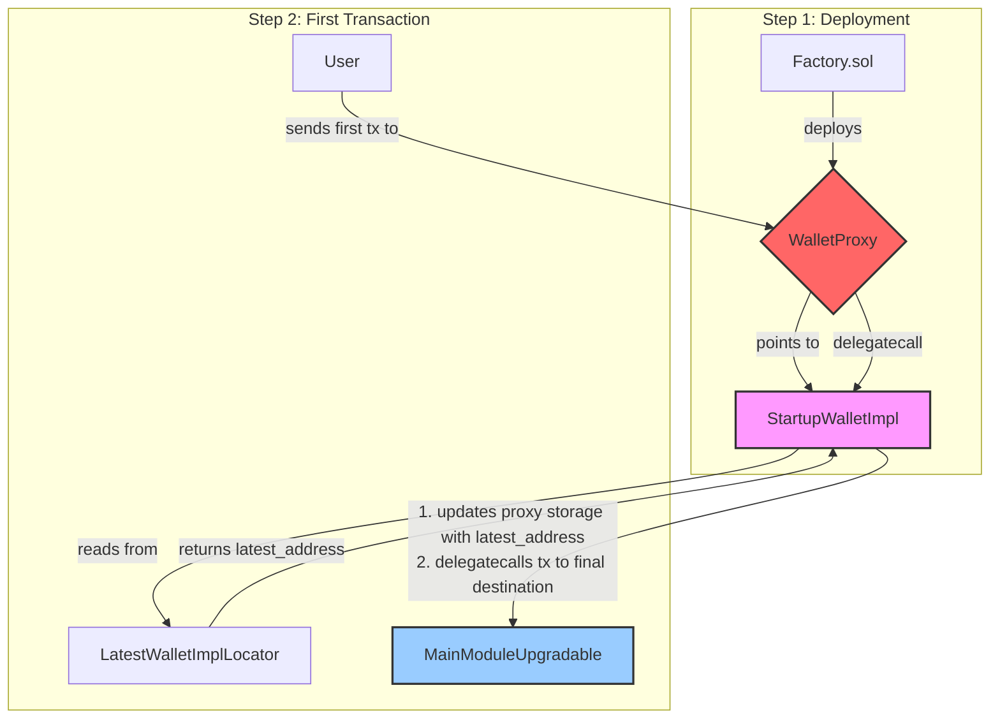
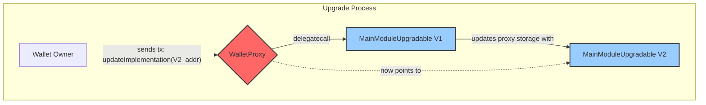

# Wallet Architecture

This document outlines the smart contract architecture for the wallet, detailing the initial deployment process, how upgrades are handled for existing wallets, and the role of the `LatestWalletImplLocator`. The architecture is designed to be both secure and flexible, using a combination of a minimalist proxy and upgradeable logic modules.

## Core Components

The system is composed of several key contracts that work together:

1.  **`WalletProxy.yul` (The Proxy)**: A minimal, gas-efficient transparent proxy written in Yul. This contract is the user-facing entry point for every wallet. Its only job is to forward all calls to a logic contract using `delegatecall`. It is immutable and its code never changes. The address of the logic contract is stored in the proxy's storage.

2.  **`StartupWalletImpl.sol` (The Bootloader)**: A one-time setup contract that acts as the _initial_ implementation for a newly deployed `WalletProxy`. Its sole purpose is to initialize the proxy with the latest version of the main wallet logic during the first transaction.

3.  **`LatestWalletImplLocator.sol` (The Locator)**: A simple, centralized contract that stores the address of the most current `MainModuleUpgradable` implementation. This contract acts as a pointer, allowing the bootloader to find the correct logic address for new wallets.

4.  **`MainModuleUpgradable.sol` (The Logic)**: The primary implementation contract containing the wallet's core business logic. It integrates various modules for features like authentication (`ModuleAuthUpgradable`), call execution (`ModuleCalls`), and upgrades (`ModuleUpdate`). This contract is designed to be upgradeable.

5.  **`Factory.sol` (The Factory)**: The contract responsible for deploying new wallet proxies. It only needs to know the addresses of `WalletProxy.yul` and `StartupWalletImpl.sol`, making it stable and rarely needing updates.

---

## Flow 1: Wallet Initialization (Deployment & First Transaction)

This two-step process ensures that newly created wallets always start with the latest and most secure code, without requiring changes to the factory contract.

1.  **Deployment**: A user calls the `Factory.sol` contract to create a new wallet. The factory deploys a new `WalletProxy` instance and sets its implementation address to a standard, fixed `StartupWalletImpl` contract.

2.  **First Transaction**:
    - The user sends the first transaction to their new wallet's address (the `WalletProxy`).
    - The proxy, still pointing to the bootloader, forwards the call to `StartupWalletImpl.sol`.
    - The bootloader's fallback function executes. It calls the `LatestWalletImplLocator` to fetch the address of the most recent `MainModuleUpgradable` implementation.
    - It then **updates the proxy's storage**, replacing its own address with the new logic address.
    - Finally, it forwards the original transaction to the new logic contract (`MainModuleUpgradable`) using another `delegatecall`.

From this point on, the `StartupWalletImpl` is never used again for this wallet. The proxy now permanently points to the main logic contract.

---

## Flow 2: Upgrading Existing Wallets

Upgrading a wallet that is already active is a separate process that **does not** involve the `StartupWalletImpl` or `LatestWalletImplLocator`. Upgrades are performed on a per-wallet basis, ensuring user sovereignty.

1.  **Deploy New Logic**: A new, improved version of the `MainModuleUpgradable` contract is deployed (e.g., `MainModuleUpgradableV2`).

2.  **Initiate Upgrade**: The owner of a wallet sends a transaction to their `WalletProxy` address, calling the `updateImplementation(address newImplementation)` function with the address of the new logic contract.

3.  **Execute Upgrade**:
    - The proxy `delegatecall`s to the current implementation (`V1`).
    - The `ModuleUpdate` logic within `V1` verifies that the caller is authorized (i.e., the wallet itself).
    - It then updates the implementation address in the proxy's storage to point to the `V2` address.

All subsequent transactions to the proxy will be handled by the `V2` logic.

---

## When to Update the `LatestWalletImplLocator`

The `LatestWalletImplLocator` should be updated only when a new, definitive version of the `MainModuleUpgradable` logic contract has been deployed and is ready for all **newly created wallets**.

**Update this address when:**

- A new version of `MainModuleUpgradable` is deployed to production.
- This new version represents the new "gold standard" for wallets that should be used by default.

Changing the address in the locator **does not affect existing wallets**. It only determines which logic contract new wallets will use after their first transaction. The update must be performed by the authorized owner of the `LatestWalletImplLocator` contract.
