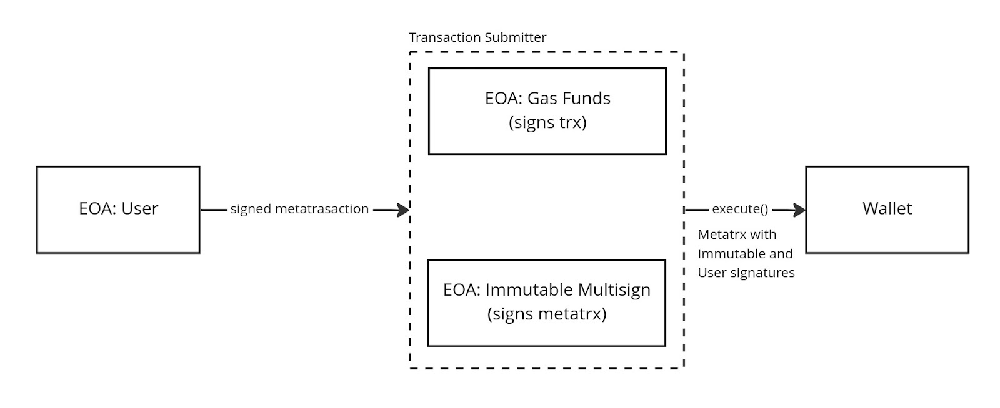
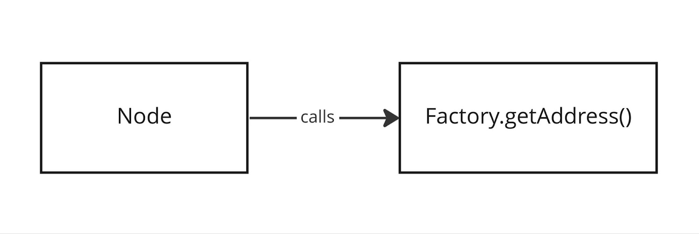
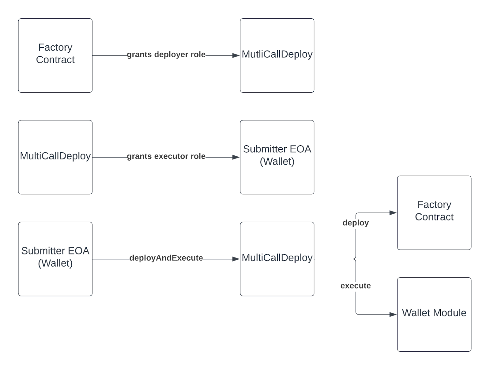
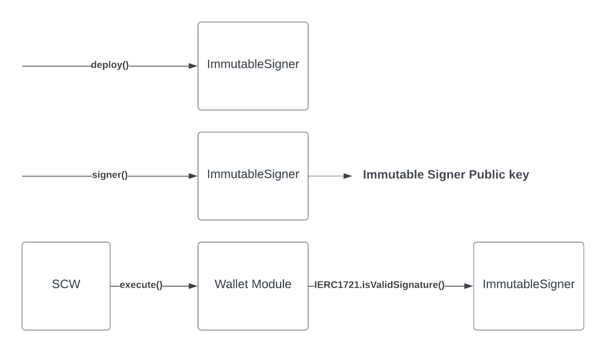
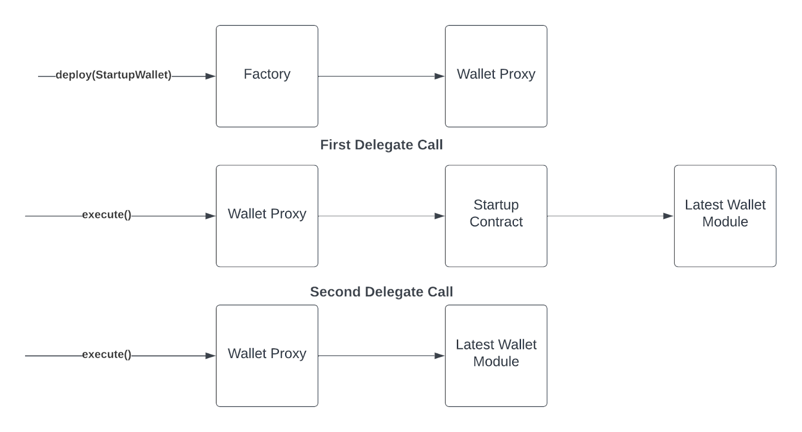

# Immutable Wallet Contracts

As part of building the [Immutable Passport][passport] wallet, we are implementing the generation of counterfactual smart contract wallet (SCW) addresses and the infrastructure that will eventually deploy those wallets to EVM networks.

[passport]: https://www.immutable.com/products/passport

The need for SCWs is driven by wanting to make accounts more secure in the case of externally owned accounts private key exfiltration on mobile platforms through malicious apps embedding Passport wallets through WebViews. The extra security comes from the wallets being multisig and verifying transactions using signatures from two parties: Immutable itself and the user. In this case, even when the user key is compromised, exfiltration of funds is still not possible.

Immutable signs transactions after an OTP 2FA, which translates to 2FA security for the user assets. The wallets are counterfactual because we use a StarkEx L2 and the users might not need to interact with the address on EVM networks unless they are bridging their assets. This is, however, not the only use case, as we also want to support users native to zkEVM networks (or other EVM-compatible networks) not only StarkEx [^1].

[^1]:
    One caveat we have identified is that different theoretically
    EVM-compatible networks have slightly different `CREATE2` behavior, which
    could lead to an user having different addresses in different networks.

To implement this, we have modified the [0xSequence's smart contract wallet][0xSequence] to include the following features:

- Modified [Factory contract][upstream-factory-contract] with better
  counterfactual addresses support.
- New [MainModule][main-module] to support wallets which can update their list
  of signers.
- New [StartupWallet][startup-wallet] which acts as a temporary main wallet
  module placeholder that finds the latest implementation at runtime during the
  execution of the first transaction.
- A [MultiCall contract][multicall-contract] that enables the SCW deployment to
  be bundled with its first transaction.
- [ImmutableSigner][immutable-signer]: a simplified SCW that can be used as a
  signer for the main 0xSequence wallet, enabling key rotation without changing
  the main wallet signer.
- An improved [Proxy contract][proxy-contract] that is gas-efficient and enables
  onchain implementation address retrieval.

A more exhaustive list of changes can be found in the [README.md](README.md).

[0xSequence]: https://github.com/0xsequence/wallet-contracts
[upstream-factory-contract]: https://github.com/0xsequence/wallet-contracts/blob/master/src/contracts/Factory.sol
[main-module]: https://github.com/immutable/wallet-contracts/blob/main/src/contracts/modules/MainModuleDynamicAuth.sol
[startup-wallet]: https://github.com/immutable/wallet-contracts/blob/main/src/contracts/startup/StartupWalletImpl.sol
[multicall-contract]: https://github.com/immutable/wallet-contracts/blob/main/src/contracts/MultiCallDeploy.sol
[immutable-signer]: https://github.com/immutable/wallet-contracts/blob/main/src/contracts/signer/ImmutableSigner.sol
[proxy-contract]: https://github.com/immutable/wallet-contracts/blob/main/src/contracts/WalletProxy.yul

Since the implementations of all of our contracts were not available at the time of CFA account generation, we also use reserved nonces to decouple deployment from contract implementation[^2].

[^2]:
    Since `CREATE` depends on nonce and deployer address, implementation does
    not change the address.

## Previous Audits

The changes we are making to 0xSequence’s contracts are relatively small when compared to the scope of the whole set of contracts, and work within the framework defined by the original contracts. As a result, previous audits to 0xSequence’s contracts might be useful as both context and starting point for auditing our changes. Those are available in 0xSequence’s repository under the [audits][audits] directory.

[audits]: https://github.com/0xsequence/wallet-contracts/tree/master/audits

## Development

Instructions for how to run and test the repo are unchanged from upstream and can be found in our repository. Check the “Dev env & release” section in the README file.

It’s a yarn-managed repository, with the most important commands being:

- `yarn build`
- `yarn test`

Respectively building contract artifacts and running the test suites.

## Architecture


The core functionality of the wallet is executing transactions. It also makes sure that:

- The deployment and the first meta transaction of a wallet are executed as a
  single root transaction.
- The deployed wallet implementation is the latest at the time of deployment.
- The wallet can modify its signers, given authorization from the previous
  signers.
- Immutable is one of the signers in all wallets, and is able to rotate its key
  without changing the signer address.

All of those constraints are displayed in the above diagram. The first ever
transaction for a smart contract wallet would:

1. An EOA with `EXECUTOR_ROLE` calls the `MultiCallDeploy.sol` contract to deploy
   the user wallet and execute a transaction.
2. `Factory.sol` deploys an instance of `WalletProxy.yul` to a deterministic
   address (the user wallet address) based on its own address, the
   `StartupWalletImpl.sol` address and the signers to the user SCW.
3. `MultiCallDeploy.sol` calls the `execute()` function on the
   `WalletProxy.yul`, which will delegate the call to the `StartupWalletImpl.sol`.
4. `StartupWalletImpl.sol` then finds the most recent wallet implementation
   address (`MainModuleDynamicAuth.sol`) using `LatestWalletImplLocator.sol`,
   updates the proxy to point to the implementation in subsequent calls, and
   delegates the call again to `MainModuleDynamicAuth.sol`.
5. `MainModuleDynamicAuth.sol` verifies the singnature in the transaction by
   checking the recovered signer against the user EOA and by calling
   `ImmutableSigner.sol` (which is the second signer in the multisig).
6. The transaction gets executed.

In subsequent transactions the flow is much simpler:

1. An EOA with `EXECUTOR_ROLE` calls the `MultiCallDeploy.sol` to execute a
   transaction.
2. `MultiCallDeploy.sol` calls the `execute()` function on the
   `WalletProxy.yul`, which will delegate the call to the
   `MainModuleDynamicAuth.sol`.
3. `MainModuleDynamicAuth.sol` verifies the singnature in the transaction by
   checking the recovered signer against the user EOA and by calling
   `ImmutableSigner.sol` (which is the second signer in the multisig).
4. The transaction gets executed.

> 🔀 **Alternate Flow**
>
> Alternatively, subsequent transactions could also fully skip the
> `MultiCallDeploy.sol` contract for improved gas usage, although this would
> require knowledge if `WalletProxy.yul` for the specific wallet in question is
> deployed or not:
>
> 1. An EOA calls `execute()` on `WalletProxy.yul` which delegates to
>    `MainModuleDynamicAuth.sol`
> 2. `MainModuleDynamicAuth.sol` verifies the singnature in the transaction by
>    checking the recovered signer against the user EOA and by calling
>    `ImmutableSigner.sol` (which is the second signer in the multisig).
> 3. The transaction gets executed.

## Incremental Deployment

Since we are building counterfactual infrastructure, it has several levels of materialization, i.e.: it’s incrementally deployed. These levels are:

- **(a)** Nothing is deployed yet, all contract addresses involved are counterfactual[^3].
- **(b)** Core infrastructure and wallet implementation is deployed.
- **(c)** User SCW is deployed during the execution of its first transaction.


[^3]:
    One requirement is that we must be able to generate user SCW addresses in
    this state without executing deployments and they should not change after
    deployment.

## Wallet Factory

The wallet factory contract interacts with other contracts and externally owned accounts, namely:

- EOAs[^4]
  - Factory Deployment: deploys the wallet factory contract.
  - Wallet Deployment: calls deploy() on the factory contract.
  - Admin: can grant and revoke "Wallet Deployment" permissions to addresses.
- Contracts
  - Wallet Proxies
  - StartupWalletImpl

[^4]:
    Note that we support both cases where those are the same EOA or different
    EOAs.


The wallet factory contract is a modified version of the 0xSequence factory contract, and the StartupWalletImpl contract takes care of updating the proxy to point to the latest wallet implementation address and delegating to that address.

Upgradeability of the wallet implementation is achieved by having the wallet main module contract (i.e.: the wallet implementation) update the address used by the wallet proxy (which is possible because the wallet proxy uses a delegate call).

Upgradeability of signers is achieved by storing a hash of the signers in the wallet storage and allowing the wallet to call itself to change the stored value.

Although not directly relevant to the scope of our changes, these are the planned interactions with the wallet contract itself:



The wallet will be a 2/2 multisign where Immutable Passport users hold one key and Immutable holds another (Immutable uses a SCW as its signer). The user signs a meta transaction and sends it to passport services, where the second signature will be added and the transaction will be sent to onchain nodes through the “Gas Funds EOA.” The execution runtime will then check the user signature using their address and the Immutable Signature by calling Immutable’s SCW.

## Public Interface

The [wallet factory contract][wallet-factory] has two public methods, both of them taking in the same arguments:

- `function getAddress(address _mainModule, bytes32 _salt)`
- `function deploy(address _mainModule, bytes32 _salt)`

`getAddress()` is a view function that generates the address for a smart contract wallet before the wallet is deployed, so it can be used as a counterfactual address by Passport. Our functional requirements were:

- Given the same parameters, should return the same address deploy() will actually create the proxy to the wallet on.

`deploy()` deploys a proxy to a smart contract wallet. This method was updated from upstream to support new requirements:

- Should revert if deployment fails.
- Should only be accessible by the `DEPLOYER_ROLE` role.
- Should emit `WalletDeployed(_contract, _mainModule, _salt)` if the wallet proxy is successfully deployed.

[wallet-factory]: https://github.com/immutable/wallet-contracts/blob/main/src/contracts/Factory.sol#L11

## Salt and Weights

All our `salt` parameters will be generated using the standard [image hash generation algorithm][image-hash-generation] from 0xSequence, and will always have a `threshold` of 2, and two signers: Immutable with `weight` of 1 and the user EOA with a `weight` of 1. Addresses are sorted to keep deterministic behavior.

```js
keccak256(abi.encode(1, address1, keccak256(abi.encode(1, address2, keccak256(abi.encode(2))))))
```

[image-hash-generation]: https://docs.sequence.xyz/wallet/wallet-contracts/wallet-configuration/#compute-image-hash

## External Interactions

At a system level, there’s a single actor interacting with the factory contract: the Passport wallet offchain services. The offchain services are triggered by the end user through interactions with the wallet frontend. As shown in the [architecture diagram](#wallet-factory), Passport services might be implemented using a few different EOAs.

Here we walk through the end to end user journeys to give some extra context.

### Display the SCW address

- The user indicates they want to check their EVM SCW address.
- The Passport Wallet backend will calculate the salt for the user given the user EOA public key and Immutable’s EOA public key. This will be done offchain using the [image hash generation algorithm](#salt-and-weights).
- The Passport Wallet backend will call `getAddress()` passing in the startup contract address (stored in the offchain database after that contract is deployed) and the generated salt[^5].
- The Factory contract will calculate the address and return it.
- Passport will display the address to the user.

[^5]: Since `getAddress()` is a pure function, this flow can optionally be implemented offchain without calling the contract.



### Execute Transaction with the undeployed SCW

1. The user initiates a transaction that requires authorization from the SCW and the smart contract wallet is still not deployed (i.e: counterfactual).

2. The Passport Wallet backend will calculate the `salt` for the user given the user EOA public key and Immutable’s EOA public key. This will be done offchain using the [image hash generation algorithm](#salt-and-weights).

3. The Passport Wallet backend will send a transaction to the relayer, signed by a **Wallet Deployment EOA** and triggering the `deployAndExecute()` method that takes in the parameters to deploy the contract and execute the users first write transaction.

4. The Passport backend will listen for the event emitted to signal the wallet has been deployed


### Deployment

- The **Factory Deployment EOA** initiates the deployment of the factory contract,
  passing in the **Admin EOA** address to the contract constructor.
- The constructor grants admin access to the **Admin EOA**.
- The **Admin EOA** invokes the factory contract to grant the wallet deployer role
  to the **Wallet Deployment EOA** that will be used subsequently to invoke the
  factory contract and deploy wallets.


## Testing

We run tests against the full 0xSequence wallet contracts testing suite to
ensure no regression has been introduced with our changes, in addition to a new
smaller testing suite written by us for the additional contracts. These
are all hardhat based tests.

The 0xSequence testing suite was modified in some aspects, however:

- Gas limits were changed in some places.
- Code was added to give `DEPLOYER_ROLE` to the testing addresses so they could
  call `Factory.deploy()`.
- Code that required the `Factory.deploy()` function to not revert when
  deployment failed was modified to expect a revert.
- Changes to constructor arguments were reflected in tests.

## New Testing Suite

The [new testing suite][new-testing] has some overlap with 0xSequence’s original
suite but focuses specifically on the added contracts. The new test files use
the `Immutable` prefix to differentiate from existing 0xSequence test files.

[new-testing]: https://github.com/immutable/wallet-contracts/blob/main/tests/

### ImmutableDeployment.spec.ts

Focuses on testing the intended end to end deployment, transaction signing and
transaction execution it's the main testing provided for `ImmutableSigner.sol`.
It's a good first stop to understanding the architecture.

It tests:

- Deterministic deployment addresses.
- 2 of 2 transaction execution in the intended configuration.
- Updating the `ImmutableSigner.sol` EOA signer.

### ImmutableFactory.spec.ts

Has four sections:

- Testing the correctness of the new `getAddress()` function.
- Testing the correctness of the modified `deploy()` function.
- Testing negative access to the `deploy()` function.
- Testing regressions on expected wallet and proxy behavior when using the new
  factory contract.

### ImmutableMultiCallDeploy.spec.ts

- Tests RBAC on the `deployExecute()` and `deployAndExecute()` functions.
- Tests wallet deployment.
- Tests transaction execution.

### ImmutableStartup.spec.ts

Tests the process of pointing the wallet proxies to the startup contract
initially, and then redirecting to the actual implementation after the first
transaction.

- Tests implementation upgrades using the startup pattern.
- Tests initialization to latest implementation.
- Tests default functionality when using the startup pattern.

# Added contracts

## MultiCallDeploy

MultiCalllDeploy.sol is a contract that handles the SCW deployment and write transaction in a single transaction. This was an optimisation made for our off-chain relayer service, to avoid the need to submit two separate transactions; the wallet deployment transaction and user transaction.

## Interface

- `function deployExecute(address _mainModule, bytes32 _salt, address factory,  IModuleCalls.Transaction[] calldata _txs, uint256 _nonce, bytes calldata _signature)`
- `function deployAndExecute(address cfa, address _mainModule, bytes32 _salt, address factory,  IModuleCalls.Transaction[] calldata _txs, uint256 _nonce, bytes calldata _signature)`

## Functionality and usage

MultiCalllDeploy interfaces with the wallet factory contract to invoke deployments, meaning this contract must be granted the deployer role. This contract also implements access control to restrict access to deployments on the factory contract. Additionally, the contract interfaces with the wallet module in order to execute the transactions.

The relayer service will use `deployAndExecute()` as the on-chain entry point. This function will check the existence of the user's SCW. If the SCW is not deployed, it will deploy the proxy contract and immediately execute the user's transaction with this newly deployed proxy state. Else, if the SCW exists, it will execute the users transaction. An example of the first case is if a CFA has assets in its balance and wishes to transfer them (deployment followed by asset transfer)

The alternative is `deployExecute()`, which deploys the wallet and executes the transaction, and does not handle the alternate case (SCW already deployed); this is for gas saving purposes. For the initial release, the relayer service will not use this function.



# Immutable Signer

ImmutableSigner.sol is a smart contract used to store the public key of the Immutable signer (the second valid signer defined in the image hash) and validate the 2-of-2 multisig at the time of transaction execution in the wallet module.

## Interface

- `event SignerUpdated(address indexed _previousSigner, address indexed _newSigner)`
- `function grantSignerRole(address _signerAdmin)`
- `function updateSigner(address _newSigner)`
- `isValidSignature(bytes32 _hash, bytes memory _signature)`

## Functionality and usage

ImmutableSigner.sol may only store a single signer address at a time, and uses `updateSigner()` (inclusive of access control) to update the signer to a new signer. This stored signer is what the supplied signatures are validated against.

Delegating the signature validation responsibility to the Immutable signer requires the use of the
`IERC1271` interface. The wallet module will call the interface on the Immutable Signer, supplying a hash and signature, if the validation succeeds, the `IERC1271_MAGICVALUE` is returned, allowing the transaction flow to continue. This validation flow requires the use of `DYNAMIC_SIGNATURE` flag which is set off-chain in the signing process.



# Startup Wallet

StartupWalletImpl.sol is an implementation contract that stores the address of the latest wallet implementation, ensuring that the wallet proxy deployment data never changes. Previously, an updated module address would needed to be supplied if undeployed proxies referenced a new wallet module.

## Interface

- `walletImplementationLocator()`

## Functionality and usage

By StartupWalletImpl.sol storing the latest wallet module, which is retrieved using an interface to LastWalletImplLocator.sol (manually updated to always point at the most updated wallet module), wallet proxies can ensure they are deployed with the latest implementation.

The above means that the initial implementation contract for all wallet proxies will be StartupWalletImpl.sol, which can be thought of as middle-ware between the proxy and the latest wallet module.

Wallet proxies will forward their first delegate calls to this contract, which will update the implementation address of the proxy to the latest module, and complete the transaction flow, forwarding the delegate call to the latest module. All subsequent calls, will then use the newly updated module as implementation, bypassing the start up wallet contract.



# Yul Proxy

WalletProxy.yul is a yul implementation of a minimal transparent proxy, with an additional function to retrieve the address of the implementation contract of the proxy. The contract was designed to minimize the deployment costs, as this will be a frequent operation.

## Interface

- `PROXY_getImplementation()`
  - Selector: `0x90611127`

## Functionality and usage

Functionally, WalletProxy.yul is intended to behave identically to a `EIP1167` minimal proxy, with the inclusion of a function to retrieve the implementation address.

With the contract being written in yul, the contract object must explicitly define it’s initcode and runtime code. The initcode copies the runtime code plus an extra 32 bytes, which contains the implementation address. The contract then stores the extra 32 bytes in the storage slot which is equal to the address of the contract.

The runtime code object defines two functions: 1) the `PROXY_getImplementation()` which loads the address stored in the storage slot equal to the address of the proxy contract and 2) a standard fallback function which delegate calls to the implementation address, either returning success or failure.

# Main Module Dynamic Auth

MainModuleDynamicAuth.sol is one of the main wallet implementations, along MainModule.sol and MainModuleUpgradable.sol. It solves some issues with MainModuleUpgradable.sol and extends the behavior of MainModule.sol.

## Interface

- `_isValidImage(bytes32 _imageHash)`

## Functionality and usage

The main goal of this contract is to be a composite implementation of the behavior in both MainModule.sol and MainModuleUpgradable.sol: it initially uses the authorization method of checking the signers in a transaction match the signers used to initialize the SCW address by the wallet factory (i.e.: it’s initially tied to the SCW address), but then it stores that signer hash (called image hash) and uses it in further verifications. This way, the signers of a wallet can be updated without changing the contract address after the initial SCW deployment.

This check is implemented by `_isValidImage(bytes32)` which is in turn called by the core of the wallet authentication implementation in ModuleAuth.sol.

The implementation is imported from ModuleAuthDynamic.sol.
