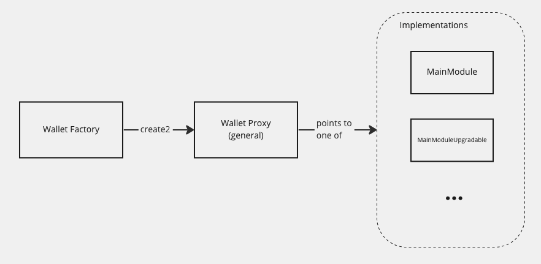

# Wallet Factory

A simple factory contract for deploying [Sequence](https://sequence.xyz/) wallets.

## Implementation

Based off [Sequence's Factory implementation](https://github.com/0xsequence/wallet-contracts/blob/master/src/contracts/Factory.sol), with some modifications:

- Added a check for successful wallet deployments (original implementation does not revert upon unsuccessful deployments)
- Added a `WalletDeployed` event to be emitted upon successful wallet deployments
- Imported OpenZeppelin's Ownable module and added an `onlyOwner` modifier to the `deployWallet` function
- Added a view function `getAddress` to return the deterministic address of a wallet, given the salt

## Custom modules

With Sequence's implementation of the wallet factory, the address of a wallet depends on the address of the `mainModule` implementation of the wallet. This means that when generating counterfactual wallet addresses, you have to pre-commit to a specific `mainModule` implementation. We can default to the Sequence MainModule implementation, which should give us all the features currently required for a smart contract wallet to function.

If we decide to introduce custom wallet features in the future, we can deploy a new module implementation and update the factory to use the new module. This will not change the address of the wallet. The upgrade process involves sending a transaction to call the `updateImplementation` function. As with all transactions from the wallet, it also requires 2 of 2 signatures (or other signature requirements) from the authorised signers.
